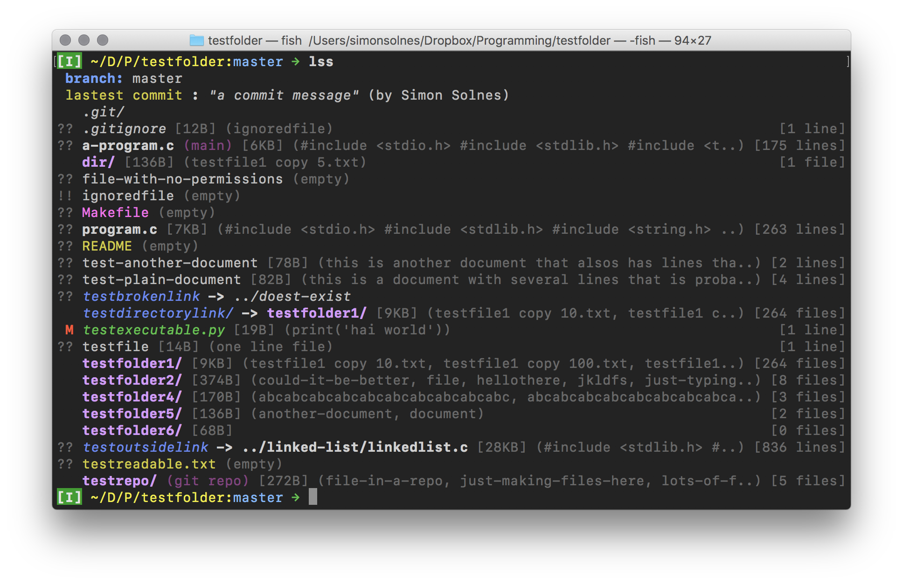

# `ls` replacement

Replacement for `ls` that shows information that is relevant. Includes `git status` for files.

Configs can be found in the `Config()` class.

## Running
`$ chmod +x main.py && ./main.py`
